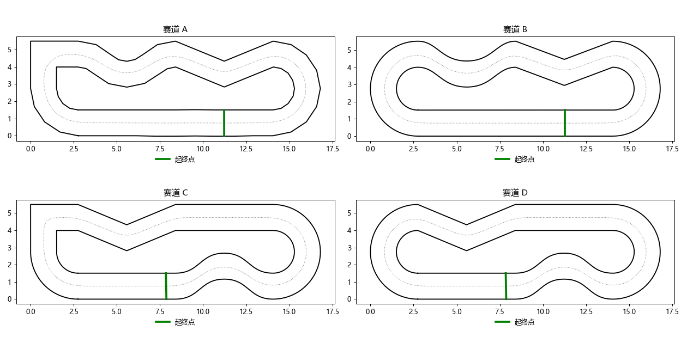

# Fastsim:已知赛道,跑最快的一圈

比赛时,车第一圈边跑边建图;建完图以后,整条赛道的边界就都知道了。
这个作业模拟的就是这一步:**给你完整的赛道边界,写一个控制器,让车一圈跑得越快越好。**

赛道是比赛的 A、B、C、D 四套。比赛当天随机抽一套,所以你的程序要**同一份代码、四条都能跑**。



## 环境

Python 3.10+:

```bash
pip install -r requirements.txt
```

## 快速开始

```bash
python grade.py              # 跑 A-D 四条,打印每圈用时
python grade.py --perturb 3  # 再加每条赛道 3 个扰动版(验收会跑,见下文)
python grade.py --plot       # 同时在 out/ 下画出轨迹(颜色是车速)
python -m pytest             # 检查仿真本身没被改坏
```

默认的 `homework/controller.py` 沿中心线、全程 1 m/s,四条都能跑完,总用时约 144 秒。

## 你要做什么

**只改 `homework/` 目录**。评分只调用 `homework/controller.py` 里的 `Controller`:

```python
class Controller:
    def __init__(self, track, car_params):
        # 开跑前调用一次:拿到整条赛道和车参数,做准备(规划路线、加载模型……)
        ...

    def __call__(self, state):
        # 之后每 0.02 秒调用一次
        return v_cmd, steer_cmd     # 目标车速 m/s,目标前轮转角 rad(左正)
```

**方法不限**:规划 + 跟踪、PID、MPC、强化学习、DAgger……都可以。默认示例用的是「规划路线和速度表 + `fastsim.PathFollower` 纯追踪跟踪」,最省事的改法是只改其中的 `plan()`。

### 接口

开跑前(`__init__`):

| | 说明 |
|---|---|
| `track.left` / `track.right` | 左(内)、右(外)边界,闭合折线 |
| `track.centerline` | 中心线,5 cm 一个点,首点是起跑线 |
| `track.bounds()` | 中心线每点的左法向,以及到左、右边界的**最近**距离(保守值,弯道处实际可用宽度可能更大) |
| `track.on_track(points)` | 判断一批点在不在赛道上 |
| `track.project(xy)` | 点投影到中心线:走过的弧长、横向偏移 |
| `track.length` | 一圈长度 |
| `car_params` | 车的全部参数,见 [docs/车辆参数.md](docs/车辆参数.md) |

每步(`state`,只读;原版赛道上是精确值,扰动版上带观测噪声):

| 字段 | 含义 |
|---|---|
| `t` | 本圈已用时间 s |
| `x`, `y` | 后轴中心位置 m |
| `yaw` | 车头朝向 rad |
| `v` | 车速 m/s |
| `yaw_rate` | 横摆角速度 rad/s |
| `accel` | 纵向加速度 m/s² |
| `steer` | 当前前轮实际转角 rad |

车的物理上限(极速 6 m/s、横向 0.8 G、加减速 0.4 G)和运动模型见 [docs/车辆参数.md](docs/车辆参数.md),代码在 `fastsim/car.py`。

## 规则

- 车从起跑线静止出发,沿中心线方向跑完一整圈计时(冲线时刻插值);
- **出界**:车身(0.56 × 0.35 m 矩形)碰到边界,即车的任何一个角出了赛道,或边界的任何一个折点进了车身;
- 超过 120 秒没跑完算超时;
- `Controller` 初始化限时 60 秒;每步平均计算时间不超过 20 ms(对应实车 50 Hz),单步不超过 1 秒;
- 返回值必须是两个有限的数,否则判接口错误;
- **全部验收赛道完赛是门槛**;过了门槛,看的是思路,圈速只作参考,不排名。

### 验收怎么做

- 验收赛道 = A–D 原版 + 每条若干**扰动版**。扰动的随机种子验收当天才定,所以请写通用的方法,不要针对四条赛道分别背答案。扰动版同时加上:
  - 地图:边界折点随机抖 ±3 cm,整张图随机旋转、平移;
  - 车:摩擦系数 ±10%,电机响应时间、舵机速度 ±20%(`Controller` 拿到的仍是标称参数);
  - 观测噪声(标准差):位置 2 cm、朝向 0.01 rad、车速 0.02 m/s、横摆角速度 0.02 rad/s、加速度 0.1 m/s²、转角 0.005 rad;
- 验收只取你的 `homework/` 目录,放进一份干净的本仓库里跑,`homework/` 以外的改动都不生效;
- 你的代码在单独的进程里运行,只能通过 `Controller` 的返回值影响车;
- 用到的第三方库(torch、scipy……)写进 `homework/requirements.txt`。

## 提交

把 `homework/` 目录打成 `学号_姓名.zip`,通过课程渠道私下提交,不要传到公开的地方。目录里要有:

- `controller.py`:你的 `Controller`;
- `思路.md`:用了什么方法、为什么这么做、试过哪些方案、哪里失败了、怎么改的;
- 其他你用到的代码、模型权重,以及 `requirements.txt`(如果用了第三方库)。

## 自行训练

仓库不提供现成的训练环境,自行选定方案。但**判定请直接调用下面这些函数**,以保证训练时和验收时完全一致:

```python
import numpy as np
from fastsim import (CarParams, DT, Progress, State, car_off_track, load_track, noisy_params,
                     noisy_state, start_pose)
from fastsim.car import Car

rng = np.random.default_rng(seed)
track = load_track('A').perturbed(seed)         # 地图扰动;不要扰动就直接 load_track('A')
car = Car(noisy_params(CarParams(), rng))       # 车参数扰动;不要就 Car(CarParams())
car.reset(*start_pose(track))
progress = Progress(track)
while True:
    state = noisy_state(State(0.0, car.x, car.y, car.yaw, car.v, car.yaw_rate, car.accel, car.steer), rng)
    v_cmd, steer_cmd = ...                      # 你的策略,只用 state
    car.step(v_cmd, steer_cmd, DT)
    if car_off_track(track, car):   # 出界(检查这一步运动的全过程)
        break
    if progress.update(car.x, car.y) >= progress.length:   # 跑完一圈
        break
```
